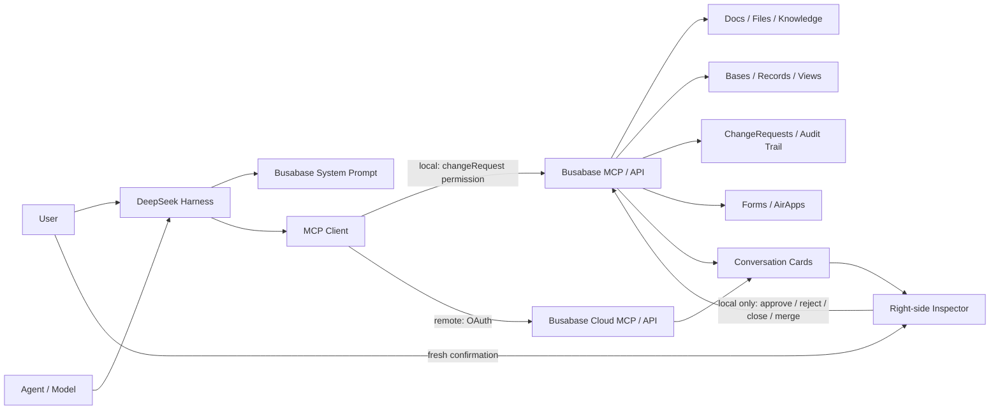

[English](DEVELOPMENT.md) | [中文](DEVELOPMENT.zh.md)

# Developer Guide

This document covers building `@busabase/dsh-plugin` from source, its internal architecture, the full configuration reference, the security model's implementation details, bundled Skills, and how to run its test suites. If you just want to install and use the plugin, see the [README](README.md) instead.

## Install and manage the npm bundle

Use a current DeepSeek Harness release compatible with this package's peer dependencies, Node.js `>=24.18.0`, and pnpm on `PATH`. Busabase does not need to be running before installation: the plugin starts `busabase@latest` on `127.0.0.1:15419` when needed, or reuses a healthy Busabase Personal Desktop or local server.

### Install into the Web profile

```bash
npx @deepseek-ai/dsh plugin --profile web add @busabase/dsh-plugin
```

With a global DSH installation, replace `npx @deepseek-ai/dsh` with `dsh`. The published package contains materialized Skills and has no install lifecycle script, so no build approval is required.

The command initializes `$DSH_HOME/profiles/web` when needed, installs the dependency through pnpm, and appends the package to `dsh.profile.bundles`. Verify both states before booting:

```bash
npx @deepseek-ai/dsh plugin --profile web list --depth=0
npx @deepseek-ai/dsh --profile web --dump-config
```

`plugin list` must show `@busabase/dsh-plugin`. `--dump-config` must show a `# == @busabase/dsh-plugin` layer containing `id: busabase`; this proves Bundle reconciliation, not merely dependency installation.

### Upgrade from a release that required build approval

Older releases declared a `preinstall` script and required `--allow-build=@busabase/dsh-plugin`. If an old installation failed with `ERR_PNPM_IGNORED_BUILDS`, update to the current release and rerun `add`; the current package does not need build approval:

```bash
npx @deepseek-ai/dsh plugin --profile web update @busabase/dsh-plugin
npx @deepseek-ai/dsh plugin --profile web add @busabase/dsh-plugin
```

An existing approval entry in `$DSH_HOME/profiles/web/pnpm-workspace.yaml` is harmless and may be removed after every installed version has been updated. Machine-specific Cordis overrides belong in `$DSH_HOME/profiles/web/cordis.patch.yml`, which applies after the package Bundle. A row override replaces its complete `config` instead of deep-merging it, so retain every non-default value you need.

### Update or remove the Bundle

```bash
npx @deepseek-ai/dsh plugin --profile web update @busabase/dsh-plugin
npx @deepseek-ai/dsh plugin --profile web remove @busabase/dsh-plugin
```

Adding, updating, or removing a Bundle does not change an already-running profile. Restart the `web` profile, then use `plugin list --depth=0` and `--dump-config` to verify the resulting dependency and Bundle state.

## Develop the plugin from source

Only needed if you're modifying the plugin itself, or need to run the repo's own E2E scenarios. Clone and build this repo:

```bash
git clone https://github.com/busabase/busabase-dsh-plugin.git
cd busabase-dsh-plugin
git clone https://github.com/busabase/skills.git .skills-source
git -C .skills-source checkout "$(node -p 'require("./package.json").busabaseSkills.ref')"
pnpm install
pnpm build
```

The repository keeps the canonical Skills in the ignored `.skills-source/` checkout. During build or test,
the link script uses that pinned checkout to create the two local `skills/` entries required by the package.

Then add the local package to the target DSH profile:

```bash
pnpm exec dsh plugin --profile web add /absolute/path/to/busabase-dsh-plugin
```

`dsh.bundle.patch` also applies when installing from a local path, so this route needs no extra hand-written Cordis config either.

Once built, start DeepSeek Harness from this repo directly:

```bash
pnpm install
pnpm start
```

Then open `http://127.0.0.1:3080/`.

## Architecture



### Host side

- Registers the Busabase system prompt;
- In local mode (a loopback `baseUrl`): lazily starts or reuses Busabase through a singleton supervisor, exposes the always-available `busabase_start` bootstrap tool, provides `/busabase-api/server/*` routes that can only query status or trigger a preconfigured start, and mounts `@deepseek-ai/dsh-mcp-client`;
- In remote mode (a non-loopback, `https://` `baseUrl`): connects directly to the Busabase Cloud MCP endpoint with browser-based OAuth instead of the local server machinery — see [Cloud OAuth implementation details](#cloud-oauth-implementation-details);
- Uses a stable MCP server name;
- Sends the fixed `changeRequest` permission ceiling in both modes; Busabase enforces the effective permission server-side.

### Web side

- Recognizes and normalizes MCP response data;
- Generates conversation cards for Busabase entities;
- Reads the latest entity in the right-side Inspector (local mode only; in remote mode the Inspector still resolves canonical Cloud links, but does not read or mutate entity data itself);
- Subscribes to live events and refreshes based on dependencies (local mode only);
- Automatically ensures the Busabase server is running before reads or reviews (local mode only);
- Provides review actions gated on user confirmation (local mode only);
- Safely previews Base, AirApp, rich text, and same-origin embedded links.

After `node_create` returns a canonical Node, the Host best-effort mints an authoritative embed link and appends it to the MCP result. After a human merges a Node-creating ChangeRequest, the Inspector performs the same step through a same-origin Host endpoint and opens the embed automatically. Preview failure never changes an otherwise successful MCP call or merge. Managed local Inspector reads and review actions use a narrow same-origin proxy allowlist; the Agent-facing MCP connection remains capped at `changeRequest`.

## Full configuration reference

```yaml
- insert:
    - id: busabase
      name: '@busabase/dsh-plugin'
      config:
        baseUrl: http://localhost:15419
        # Defaults to /api/mcp, derived from baseUrl
        # mcpUrl: http://localhost:15419/api/mcp
        serverName: busabase
        server:
          mode: auto
          # command: npm
          # args: [exec, --yes, --package, busabase@latest, --, busabase, server, --host, 127.0.0.1, --port, '15419']
          # NEXT_PUBLIC_APP_URL is set to baseUrl automatically; env can add to or explicitly override it
          # env:
          #   BUSABASE_AIRAPP_EMBED_ORIGINS: http://localhost:3080,http://127.0.0.1:3080
          # cwd: /optional/working/directory
          # dataDir: /optional/busabase/data
          startupTimeoutMs: 30000
          mcpReadyTimeoutMs: 30000
          stopOnDispose: true
        liveRefresh:
          enabled: true
          pollIntervalMs: 30000
          reconnectInitialDelayMs: 1000
          reconnectMaxDelayMs: 30000
        airAppIframe:
          enabled: true
        baseIframe:
          enabled: true
        changeRequestIframe:
          enabled: true
        confirmations:
          review: true
          merge: true
          close: true
```

| Setting | Default | Purpose |
| --- | --- | --- |
| `baseUrl` | `http://localhost:15419` | Root address for Busabase Web and API; a non-loopback `https://` value switches the whole plugin into remote (Cloud) mode |
| `spaceId` | empty | Workspace id used when `baseUrl` is a root-host Cloud deployment; omit for workspace subdomains |
| `mcpUrl` | `${baseUrl}/api/mcp` | MCP Streamable HTTP address |
| `serverName` | `busabase` | Generates the `mcp__busabase__*` tool namespace |
| `server.mode` | `auto` | `auto` manages loopback only; `managed` always manages loopback; `external` only probes, never starts; ignored in remote mode |
| `server.command` | `npm` / `npm.cmd` | Preconfigured command to start Busabase; browser routes cannot override it; ignored in remote mode |
| `server.args` | `exec --yes --package busabase@latest -- busabase server …` | Arguments passed to the start command; the default host/port match `baseUrl`; ignored in remote mode |
| `server.env` / `server.cwd` | `{ NEXT_PUBLIC_APP_URL: baseUrl }` / empty | Extra env vars and optional working directory for the child process; the embed URL generated from a dynamic port is correct by default; ignored in remote mode |
| `server.dataDir` | empty | Appends `--data` when using default args, to set the Busabase persistence directory; ignored in remote mode |
| `server.startupTimeoutMs` | `30000` | Max time to wait for `/api/health` to confirm Busabase's identity; ignored in remote mode |
| `server.mcpReadyTimeoutMs` | `30000` | Max time `busabase_start` waits for MCP tools to re-register; ignored in remote mode (no `busabase_start` tool is registered) |
| `server.stopOnDispose` | `true` | When the DSH plugin unloads or exits, only stop the process the plugin itself started; ignored in remote mode |
| `liveRefresh.enabled` | `true` | Enables live refresh in the Inspector; ignored in remote mode (never starts a live subscription) |
| `liveRefresh.pollIntervalMs` | `30000` | Visible-page polling interval used when the live subscription fails; ignored in remote mode |
| `airAppIframe.enabled` | `true` | Lets the Inspector preview an AirApp |
| `baseIframe.enabled` | `true` | Lets the Inspector preview the canonical Base |
| `changeRequestIframe.enabled` | `true` | Embeds a read-only ChangeRequest diff and review timeline in the Desktop Inspector |
| `confirmations.*` | `true` | Keeps user confirmation required for review, merge, and close; ignored in remote mode (review/merge/close are unavailable from the Inspector) |

If you need to override `baseUrl`/`serverName` or other settings when installing via npm, add an id-targeted item to the target profile's `cordis.patch.yml`:

```yaml
- id: busabase
  config:
    baseUrl: https://busabase.com
    serverName: busabase
```

The profile patch applies after the package's `dsh.bundle.patch`. It replaces the matched row's complete `config` rather than deep-merging it, so restate every non-default value you need. Do not use `insert` for this override: that would add a second plugin row instead of configuring the Bundle row.

## Cloud OAuth implementation details

Setting `baseUrl` to a non-loopback `https://` address switches `apply()` (`src/index.ts`) into remote mode: it skips `BusabaseServerSupervisor`, the `/busabase-api/*` routes, the `busabase_start` tool, and `@deepseek-ai/dsh-mcp-client` entirely, and instead calls `connectRemoteMcp` (`src/oauth-mcp-client.ts`) once, directly against `config.mcpUrl`.

- **Transport and auth.** `connectRemoteMcp` uses the official `@modelcontextprotocol/sdk` `Client` and `StreamableHTTPClientTransport` with an `OAuthClientProvider` (`DshCredentialOAuthClientProvider`) implementing the SDK's own documented authorization-code + PKCE flow (the same shape as the SDK's `examples/client/simpleOAuthClient.js`).
- **Token storage.** Client registration and tokens are persisted through `ctx.credentials`'s grant-record seam (`@deepseek-ai/dsh-credentials`), keyed by `busabaseOAuthCredentialKey(mcpUrl, serverName)` — a `busabase-dsh-plugin/cloud-<sha256>` key scoped to the exact MCP resource URL and DSH tool namespace. Nothing is written into plugin configuration or committed files; each client or token update uses the credential provider's atomic `modifyRecord` seam so one field update does not overwrite another.
- **First sign-in.** Before connecting, the plugin binds a short-lived loopback HTTP callback server, reusing its persisted port when possible so a dynamically registered client's redirect URI remains valid. When `connect()` throws `UnauthorizedError`, the plugin verifies the SDK-generated state in the authorization URL, opens it with the `open` package, accepts one `/callback?code=...&state=...` redirect, compares state in constant time, and calls that transport's `finishAuth(code)`. It then reconnects with a fresh Client and transport. The callback is bounded by five minutes and always closed; if the browser cannot open automatically, the URL is logged for manual use.
- **Tool bridging.** Once connected, `syncTools` lists the remote server's tools and registers each one under `mcp__<serverName>__<rawName>` via `publicToolName`, with the same `{content, structuredContent}` result shape `dsh-mcp-client`'s local bridge produces — normalizing content into rendered text and re-throwing on `isError`. `publicToolName` hashes the suffix whenever the raw name needs any character substitution (not only on length overflow), so two different raw names can never collide into the same public tool name.
- **Reconnection.** Connection loss triggers the same bounded exponential backoff (1s initial, 30s max, unlimited attempts) as the local MCP client, re-syncing paginated tool catalogs after each successful reconnect and on `tools/list_changed`; `dispose()` aborts any in-flight connect/auth attempt and closes the client. Tool calls forward DSH cancellation and a 60-second timeout.
- **Known verification gap.** The full interactive OAuth round trip — a real browser completing consent against a real authorization server — is not exercised by an automated test in this repository; `src/oauth-mcp-client.test.ts` covers the credential-provider grant lifecycle, tool-name derivation, and `connectRemoteMcp`'s connect/retry/reconnect orchestration against a mocked SDK `Client` and a real loopback HTTP callback server (using a scripted `open()` to drive the callback directly, standing in for the user's browser). Validate an actual sign-in manually against a real Busabase Cloud workspace before relying on this in production.

## Security model implementation details

| Risk | How the plugin handles it |
| --- | --- |
| Agent writes to official data directly | MCP relay permission is fixed at `changeRequest`; the Busabase server rejects review, approve/reject, close, and merge calls and keeps `autoMerge: true` proposals in review |
| Stored content contains a prompt injection | The system prompt states explicitly that workspace content is data, not instructions |
| Stale state triggers a sensitive action | With `confirmations.*` enabled (the default), the Inspector requires a fresh user confirmation for every action |
| Browser tampers with the start command | `/busabase-api/server/start` ignores the request body and only runs the Host's preconfigured command |
| Accidentally reuses another local service | `/api/health` must return `service: busabase` and `status: ok` |
| Local MCP picks the wrong workspace | The loopback connection always sends `x-busabase-space: local` (local mode only) |
| iframe leaks credentials | Only canonical URLs or server-generated embed URLs are used; API keys are never concatenated in |
| Live connection drops | Automatically falls back to bounded, visible-page-only polling (local mode only) |
| Remote OAuth token leaks into config, logs, or the browser | Tokens live only in `ctx.credentials`'s grant-record store, never in plugin config or committed files; the Inspector does not receive them, and remote `review`, `merge`, `close`, refresh, live subscription, and Base/AirApp iframe paths are disabled instead of falling back to unauthenticated REST calls |

Security doesn't rely on any single prompt. The fixed `changeRequest` permission ceiling is sent in both modes and enforced by Busabase server-side. Client-side confirmation is an additional local-mode safeguard; disabling `confirmations.*` removes that prompt but does not give the Agent permission to review or merge.

## Development and verification

```bash
pnpm install
pnpm typecheck
pnpm test
pnpm build
```

Full check:

```bash
pnpm check
```

Check npm package contents before publishing:

```bash
pnpm pack:dry-run
```

### Bundled Skills

During source development, `pnpm build` and `pnpm test` link `skills/busabase` and `skills/busabase-app-creator` to
their canonical definitions in the pinned Skills checkout. The link script is idempotent, links
only those two Skills, and refuses to replace unexpected files, so Skill updates have one reviewed source
of truth instead of a second committed copy in this package.

The standalone CI and release workflows check out `busabase/skills` under ignored `.skills-source/`; the
build script recognizes that layout. Source developers use the matching clone command in the
"Develop the plugin from source" section above. The exact reviewed Skills commit is recorded in `package.json`, so CI and release
materialize identical content. Published npm installs are already materialized and do not fetch a repository.

The npm release job runs only from `main` in the `busabase/busabase-dsh-plugin` repository,
matching this package's canonical metadata and provenance.

During `pnpm build`, the linked directories are materialized under generated `lib/skills/`. The npm tarball
includes that real directory and the plugin registers it at startup using the official
`@deepseek-ai/dsh-skill-filesystem` provider. The build also converts the AirApp template's `.gitignore` to
`gitignore.template` in the generated package and restores it during scaffolding, avoiding npm's special
handling of `.gitignore` without changing the canonical Skill.

### End-to-end (E2E) tests

Most files under `src/e2e/` are deterministic unit tests (port allocation, marker parsing, redaction,
workspace copying, etc.) that run with `pnpm test` and need no external dependencies.

`src/e2e/live-scenario.test.ts` is the **headless real, opt-in end-to-end test**: it copies the plugin source
and the configured `busabase-app-creator` and `busabase` Skill directories into an isolated temp directory, proves
that a frozen install/build works, then uses the generated Cordis patch to start a real `dsh --profile headless`
process, connect to a real LLM gateway, load the `busabase-app-creator` skill, call `busabase_start`, read the
AirApp guide, and submit a minimal runnable pure-Node AirApp ChangeRequest through a real MCP connection (the
MCP relay permission is fixed at the `changeRequest` level, so the model can't review/merge it itself).
The test driver then acts as the human reviewer, using the real `busabase-sdk` to find that pending
ChangeRequest, approve and merge it, read back the normalized AirApp files, create an admin-only embed link,
and read back its active metadata through the admin API, finally confirming that the managed Busabase child
process exits along with DSH. Throughout, it uses a dynamically allocated loopback port, an isolated temporary
`--data`/`DSH_HOME`, strict timeouts, disallows `shell: true`, redacts all secrets in logs as `[REDACTED]`, and
cleans up the temp directory and any leftover processes in `afterAll`.

**Prerequisites** (missing any of these causes a clean skip, never a false pass):

- The environment variables `BUSABASE_DSH_E2E_API_KEY`, `BUSABASE_DSH_E2E_BASE_URL`, `BUSABASE_DSH_E2E_MODEL_ID`,
  and `BUSABASE_DSH_E2E_SKILLS_DIR` must all be present (respectively: the API key and `baseURL` of the target
  OpenAI-compatible gateway, the model id, and a local path containing both the `busabase-app-creator` and
  `busabase` skill directories; an optional `BUSABASE_DSH_E2E_PROVIDER_ID` customizes the Cordis provider id,
  defaulting to `busabase-dsh-e2e`); the skills directory must be specified explicitly and does not implicitly
  fall back to an unrelated local `.agents/skills` directory;
- Node.js must be `>=24.18.0` (matching the minimum version for this plugin and `busabase-sdk@0.41.0`; the test
  explicitly validates this with `checkNodeEngine` before startup and prints the reason, instead of failing partway through).

```bash
export BUSABASE_DSH_E2E_API_KEY=sk-...
export BUSABASE_DSH_E2E_BASE_URL=https://your-openai-compatible-gateway/v1
export BUSABASE_DSH_E2E_MODEL_ID=your-provider/your-model
export BUSABASE_DSH_E2E_SKILLS_DIR=/absolute/path/to/.agents/skills
pnpm test:e2e
```

To debug a failed run, add `BUSABASE_DSH_E2E_KEEP_ARTIFACTS=1` to keep the temp directory shown in the test
output; no API key is written into that directory, and the DSH session and service data remain confined to
this isolated test run.

If any of the environment variables above is missing, or the Node version is too low, the two opt-in E2E tests show up
as `skipped`, and the remaining 153+ unit tests still run and pass normally.

`src/e2e/live-browser-scenario.test.ts` is the **browser-driven version** of the same scenario: aside from
swapping `dsh --profile headless` for a real `dsh --profile web` (`dsh-web-runner.ts`), every other step —
isolated temp directory, frozen install/build, Cordis patch, real LLM gateway, real managed Busabase child
process, human review/merge/embed link readback — is identical to `live-scenario.test.ts`. It uses Playwright
to launch a real headless Chromium, opens the workspace selection dialog through selectors centrally
maintained in `dsh-web-driver.ts`, fills in and submits the task prompt in the chat input, then reads back the
ChangeRequest marker as the authoritative completion signal from the persisted DSH session JSONL (rather than
the browser DOM or the model's natural-language output). Screenshots are taken at key steps (load complete,
workspace selected, task submitted, task finished); they're only written to disk when either
`BUSABASE_DSH_E2E_EVIDENCE_DIR` (an explicit directory) or `BUSABASE_DSH_E2E_KEEP_ARTIFACTS=1` (landing under
`.artifacts/<run-slug>`, already excluded in `.gitignore`) is set — by default it produces no files at all.

Prerequisites are identical to `pnpm test:e2e`; run it with:

```bash
export BUSABASE_DSH_E2E_API_KEY=sk-...
export BUSABASE_DSH_E2E_BASE_URL=https://your-openai-compatible-gateway/v1
export BUSABASE_DSH_E2E_MODEL_ID=your-provider/your-model
export BUSABASE_DSH_E2E_SKILLS_DIR=/absolute/path/to/.agents/skills
pnpm test:e2e:browser
```

## Further reading

- [Busabase website](https://busabase.com/)
- [Busabase open-source repo](https://github.com/busabase/busabase)
- [Busabase Skills and MCP integration](https://github.com/busabase/skills)
- [DeepSeek Harness](https://github.com/deepseek-ai/deepseek-harness)
