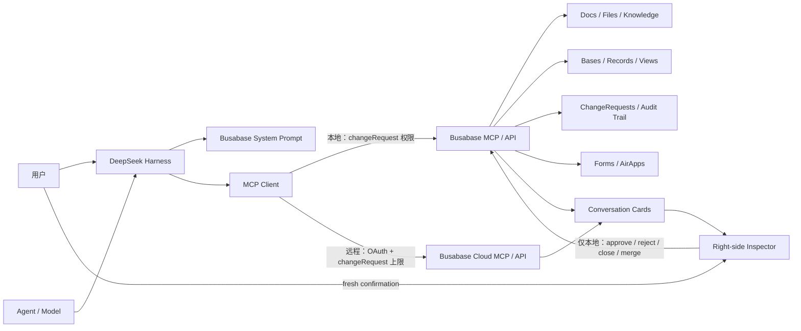

[English](DEVELOPMENT.md) | [中文](DEVELOPMENT.zh.md)

# 开发者指南

本文档涵盖如何从源码构建 `@busabase/dsh-plugin`、内部架构、完整配置参考、安全模型的实现细节、随包 Skills，以及如何运行测试套件。如果你只想安装并使用该插件，请查看 [README](README.zh.md)。

## 安装与管理 npm Bundle

请使用与本包 peer dependencies 兼容的当前 DeepSeek Harness 版本、Node.js `>=24.18.0`，并确保 `PATH` 中存在 pnpm。安装前不需要启动 Busabase：插件会在需要时于 `127.0.0.1:15419` 启动 `busabase@latest`，或复用健康的 Busabase Personal Desktop / 本地服务。

### 安装到 Web profile

```bash
npx @deepseek-ai/dsh plugin --profile web add @busabase/dsh-plugin
```

如果已全局安装 DSH，请用 `dsh` 替换 `npx @deepseek-ai/dsh`。发布包已经包含实体化的 Skills，并且没有安装生命周期脚本，因此不需要构建授权。

命令会在需要时初始化 `$DSH_HOME/profiles/web`，通过 pnpm 安装依赖，并将包加入 `dsh.profile.bundles`。启动前请验证两种状态：

```bash
npx @deepseek-ai/dsh plugin --profile web list --depth=0
npx @deepseek-ai/dsh --profile web --dump-config
```

`plugin list` 必须显示 `@busabase/dsh-plugin`。`--dump-config` 必须显示包含 `id: busabase` 的 `# == @busabase/dsh-plugin` 配置层；第二项验证的是 Bundle 对账，而不只是依赖安装。

### 从曾经需要构建授权的版本升级

旧版本曾声明 `preinstall`，需要传入 `--allow-build=@busabase/dsh-plugin`。如果旧版本安装遇到 `ERR_PNPM_IGNORED_BUILDS`，请先更新到当前版本，再重新执行 `add`；当前包不再需要构建授权：

```bash
npx @deepseek-ai/dsh plugin --profile web update @busabase/dsh-plugin
npx @deepseek-ai/dsh plugin --profile web add @busabase/dsh-plugin
```

`$DSH_HOME/profiles/web/pnpm-workspace.yaml` 中已有的授权记录不会造成影响；确认所有已安装版本都完成更新后，可以删除该记录。机器专用 Cordis 覆盖应写入 `$DSH_HOME/profiles/web/cordis.patch.yml`，它在包 Bundle 之后应用。配置行会整段替换 `config`，而不是深度合并，因此请保留所有需要的非默认值。

### 更新或删除 Bundle

```bash
npx @deepseek-ai/dsh plugin --profile web update @busabase/dsh-plugin
npx @deepseek-ai/dsh plugin --profile web remove @busabase/dsh-plugin
```

添加、更新或删除 Bundle 不会改变正在运行的 profile。请重启 `web` profile，再通过 `plugin list --depth=0` 和 `--dump-config` 验证最终依赖与 Bundle 状态。

## 从源码开发插件

只有在你要修改插件本身、或需要跑通仓库自带的 E2E 场景时才需要这条路径。克隆并构建本仓库：

```bash
git clone https://github.com/busabase/busabase-dsh-plugin.git
cd busabase-dsh-plugin
git clone https://github.com/busabase/skills.git .skills-source
git -C .skills-source checkout "$(node -p 'require("./package.json").busabaseSkills.ref')"
pnpm install
pnpm build
```

仓库把规范 Skill 放在已忽略的 `.skills-source/` checkout 中。构建或测试时，链接脚本会使用这个固定版本
的 checkout 创建打包所需的两个本地 `skills/` 入口。

再把本地包加入目标 DSH profile：

```bash
pnpm exec dsh plugin --profile web add /absolute/path/to/busabase-dsh-plugin
```

`dsh.bundle.patch` 同样会在本地路径安装时生效，因此这条路径也不需要额外手写 Cordis 配置。

构建完成后，可以直接在本仓库启动 DeepSeek Harness：

```bash
pnpm install
pnpm start
```

然后打开 `http://127.0.0.1:3080/`。

## 架构



### Host 侧

- 注册 Busabase 系统提示词；
- 本地模式（loopback `baseUrl`）：通过单例 supervisor 延迟启动或复用 Busabase，暴露 `busabase_start`，提供 `/busabase-api/server/*` 路由，并挂载 `@deepseek-ai/dsh-mcp-client`；
- 远程模式（非 loopback 的 `https://` `baseUrl`）：通过浏览器 OAuth 直接连接 Busabase Cloud MCP，不启动或探测本地服务；
- 使用稳定的 MCP server name；
- 两种模式都固定发送 `changeRequest` 权限上限，由 Busabase 服务端执行最终权限判断。

### Web 侧

- 识别并标准化 MCP 返回数据；
- 为 Busabase 实体生成对话卡片；
- 在右侧 Inspector 读取最新实体（仅本地模式；远程模式只解析 Cloud 正式链接）；
- 订阅实时事件并按依赖刷新（仅本地模式）；
- 在读取或审阅前自动确保 Busabase Server 已启动（仅本地模式）；
- 提供用户确认后的审阅操作（仅本地模式）；
- 本地模式安全预览 Base、AirApp、富文本和同源嵌入链接；Cloud 模式改为打开正式链接。

在 `node_create` 返回 canonical Node 后，Host 会尽力生成一个权威的 embed 链接并附加到 MCP 结果中。人类合并一个创建 Node 的 ChangeRequest 之后，Inspector 通过同源 Host 端点执行相同的步骤，并自动打开该 embed。预览失败永远不会改变一次本来成功的 MCP 调用或合并结果。受管理的本地 Inspector 读取与审阅动作使用一份范围狭窄的同源代理白名单；面向 Agent 的 MCP 连接始终被限制在 `changeRequest`。

## 完整配置参考

```yaml
- insert:
    - id: busabase
      name: '@busabase/dsh-plugin'
      config:
        baseUrl: http://localhost:15419
        # 默认由 baseUrl 推导为 /api/mcp
        # mcpUrl: http://localhost:15419/api/mcp
        serverName: busabase
        server:
          mode: auto
          # command: npm
          # args: [exec, --yes, --package, busabase@latest, --, busabase, server, --host, 127.0.0.1, --port, '15419']
          # NEXT_PUBLIC_APP_URL 会自动设为 baseUrl；env 可补充或显式覆盖
          # env:
          #   BUSABASE_AIRAPP_EMBED_ORIGINS: http://localhost:3080,http://127.0.0.1:3080
          # cwd: /optional/working/directory
          # dataDir: /optional/busabase/data
          startupTimeoutMs: 30000
          mcpReadyTimeoutMs: 30000
          stopOnDispose: true
        liveRefresh:
          enabled: true
          pollIntervalMs: 30000
          reconnectInitialDelayMs: 1000
          reconnectMaxDelayMs: 30000
        airAppIframe:
          enabled: true
        baseIframe:
          enabled: true
        changeRequestIframe:
          enabled: true
        confirmations:
          review: true
          merge: true
          close: true
```

| 配置项 | 默认值 | 作用 |
| --- | --- | --- |
| `baseUrl` | `http://localhost:15419` | Busabase Web 与 API 根地址；非 loopback 的 `https://` 值会把整个插件切换到远程 Cloud 模式 |
| `spaceId` | 空 | 当 `baseUrl` 是根域名的 Cloud 部署时使用的工作区 id；工作区子域名场景可省略 |
| `mcpUrl` | `${baseUrl}/api/mcp` | MCP Streamable HTTP 地址 |
| `serverName` | `busabase` | 生成 `mcp__busabase__*` 工具命名空间 |
| `server.mode` | `auto` | `auto` 仅管理 loopback；`managed` 强制管理 loopback；`external` 只探测、不启动；远程模式忽略此项 |
| `server.command` | `npm` / `npm.cmd` | 启动 Busabase 的预配置命令；浏览器路由不能覆盖它；远程模式忽略此项 |
| `server.args` | `exec --yes --package busabase@latest -- busabase server …` | 传给启动命令的参数；默认 host/port 与 `baseUrl` 一致；远程模式忽略此项 |
| `server.env` / `server.cwd` | `{ NEXT_PUBLIC_APP_URL: baseUrl }` / 空 | 子进程附加环境变量和可选工作目录；远程模式忽略此项 |
| `server.dataDir` | 空 | 使用默认参数时追加 `--data`，指定 Busabase 持久化目录；远程模式忽略此项 |
| `server.startupTimeoutMs` | `30000` | 等待 `/api/health` 确认 Busabase 身份的最长时间；远程模式忽略此项 |
| `server.mcpReadyTimeoutMs` | `30000` | `busabase_start` 等待 MCP 工具重新注册的最长时间；远程模式不注册该工具 |
| `server.stopOnDispose` | `true` | DSH 插件卸载或退出时，只停止插件自己启动的进程；远程模式忽略此项 |
| `liveRefresh.enabled` | `true` | 启用 Inspector 实时刷新；远程模式不启动实时订阅 |
| `liveRefresh.pollIntervalMs` | `30000` | 实时订阅失败后的可见页面轮询间隔；远程模式忽略此项 |
| `airAppIframe.enabled` | `true` | 允许 Inspector 预览 AirApp |
| `baseIframe.enabled` | `true` | 允许 Inspector 预览 canonical Base |
| `changeRequestIframe.enabled` | `true` | 在 Desktop Inspector 中嵌入只读 ChangeRequest diff 与审阅时间线 |
| `confirmations.*` | `true` | 为审阅、合并和关闭保留用户确认；远程 Inspector 不提供这些操作 |

如果通过 npm 安装后需要覆盖 `baseUrl`、`serverName` 等设置，请在目标 profile 的 `cordis.patch.yml` 中加入按 id 定位的条目：

```yaml
- id: busabase
  config:
    baseUrl: https://busabase.com
    serverName: busabase
```

Profile patch 会在包内 `dsh.bundle.patch` 之后应用。它会替换匹配 row 的完整 `config`，而不是深度合并，因此需要重述所有要保留的非默认值。不要用 `insert` 完成此覆盖：那会新增第二个 Plugin row，而不是配置 Bundle 中已有的 row。

## Cloud OAuth 实现细节

把 `baseUrl` 设置为非 loopback 的 `https://` 地址后，`src/index.ts` 会跳过 `BusabaseServerSupervisor`、`/busabase-api/*`、`busabase_start` 和内置 `@deepseek-ai/dsh-mcp-client`，改由 `src/oauth-mcp-client.ts` 直接连接 `config.mcpUrl`。

- **传输与认证：** 使用官方 `@modelcontextprotocol/sdk` 的 `Client`、`StreamableHTTPClientTransport` 与 `OAuthClientProvider`，执行 authorization code + PKCE、服务发现、动态客户端注册和 refresh token 流程。
- **凭据存储：** 客户端注册信息和 token 通过 `ctx.credentials` 的 grant record 保存，key 由 MCP server name 与完整 resource URL 的 SHA-256 派生。配置、日志和浏览器端都不会拿到 token；刷新写入使用原子的 `modifyRecord`。
- **首次登录：** 连接前先绑定短生命周期 loopback callback server，并尽量复用持久化端口，保证动态注册的 redirect URI 继续有效。收到 `UnauthorizedError` 后，插件验证 SDK 生成的 state，打开系统浏览器，接收一次 `/callback?code=...&state=...`，常量时间比对 state，调用当前 transport 的 `finishAuth(code)`，再用全新的 Client 和 transport 连接。callback 最长等待五分钟，并在成功、失败和卸载时关闭。
- **工具桥接：** 分页读取工具目录，按 `mcp__<serverName>__<rawName>` 注册，并保持与本地桥一致的 `{content, structuredContent}` 返回结构。工具名规范化发生信息损失时会追加稳定 hash，避免碰撞；`tools/list_changed` 会触发原子重同步。
- **重连与取消：** 断线后按 1 秒起步、30 秒封顶的指数退避重连；工具调用透传 DSH 的取消 signal，并设置 60 秒 timeout。插件卸载会中止认证、关闭 client 并注销工具。
- **验证边界：** 自动化测试覆盖 credential 生命周期、state 校验、真实 loopback callback、fresh transport 重连、权限 header 和工具桥；真实 Busabase Cloud 租户中的交互式授权仍需发布前手工验证。

## 安全模型实现细节

| 风险 | 插件的处理方式 |
| --- | --- |
| Agent 直接修改正式数据 | MCP relay 权限固定为 `changeRequest`；Busabase 服务端会拒绝 review、approve/reject、close、merge 调用，并让携带 `autoMerge: true` 的提案继续进入审阅 |
| 存储内容包含提示注入 | 系统提示明确规定工作区内容只是数据，不是指令 |
| 旧状态触发敏感操作 | `confirmations.*` 开启时（默认值），Inspector 每次动作都要求新的用户确认 |
| 浏览器篡改启动命令 | `/busabase-api/server/start` 不读取请求体，只执行 Host 预配置命令 |
| 错误复用其他本地服务 | `/api/health` 必须返回 `service: busabase` 与 `status: ok` |
| 本地 MCP 选错工作区 | loopback 连接固定发送 `x-busabase-space: local` |
| iframe 泄露凭据 | 只使用 canonical URL 或服务端生成的 embed URL，不拼接 API Key |
| 实时连接中断 | 自动回退到有界、仅可见页面轮询 |
| 远程 OAuth token 泄露到配置、日志或浏览器 | token 只保存在 Host 的 `ctx.credentials` grant record；远程 Inspector 不接收 token，并禁用 review、merge、close、refresh、实时订阅和 Base/AirApp iframe，而不是回退到未认证 REST 请求 |

安全不依赖某一句提示词。两种模式都会发送固定的 `changeRequest` 权限上限，并由 Busabase 服务端执行；Client 用户确认是本地模式默认开启的额外保护。关闭 `confirmations.*` 会移除该提示，但不会让 Agent 获得审阅或合并权限。

## 开发与验证

```bash
pnpm install
pnpm typecheck
pnpm test
pnpm build
```

完整检查：

```bash
pnpm check
```

打包前检查 npm 内容：

```bash
pnpm pack:dry-run
```

### 随包 Skills

在源码开发环境执行 `pnpm build` 或 `pnpm test` 时，链接脚本会把 `skills/busabase` 和
`skills/busabase-app-creator` 分别链接到固定版本 Skills checkout 中的规范定义。脚本可重复执行，
只链接这两个 Skill，并拒绝覆盖意外存在的文件，因此 Skill 更新只需维护一份可审阅的源文件。

独立 CI 与发布 workflow 会把 `busabase/skills` checkout 到已忽略的 `.skills-source/`，构建脚本会识别该布局。
源码开发者使用上方「从源码开发插件」章节中的对应 clone 命令。经过 review 的 Skill
commit 会记录在 `package.json`，因此 CI 和发布流程实体化的是完全相同的内容。已发布的 npm 包已经实体化
Skills，不会在安装时拉取仓库。

npm 发布任务只允许在 `busabase/busabase-dsh-plugin` 仓库中从 `main` 运行，确保与 package 的 canonical
metadata 和 provenance 一致。

执行 `pnpm build` 时，链接目录会被实体化到生成的 `lib/skills/`。npm tarball 包含这个真实目录，
插件启动时再通过官方 `@deepseek-ai/dsh-skill-filesystem` provider 注册。构建过程还会在生成包中把
AirApp 模板的 `.gitignore` 转成 `gitignore.template`，并在脚手架生成项目时恢复文件名，从而避开 npm
对 `.gitignore` 的特殊处理，同时不修改规范 Skill。

### 端到端（E2E）测试

`src/e2e/` 下大多数文件是确定性单元测试（端口分配、marker 解析、redaction、工作区复制等），随
`pnpm test` 一起跑，不需要任何外部依赖。

其中 `src/e2e/live-scenario.test.ts` 是**真实、可选（opt-in）的无头端到端测试**：它会把插件源码和
显式配置的 `busabase-app-creator`、`busabase` Skill 目录复制进一个隔离的临时目录，证明
frozen install/build 可用，再用生成的 Cordis patch 启动一个真实的 `dsh --profile headless` 进程，
连接真实 LLM 网关，加载 `busabase-app-creator` 技能，调用 `busabase_start`、读取 AirApp 指南，并通过
真实 MCP 提交一个最小可运行的纯 Node AirApp ChangeRequest（MCP relay 权限固定为 `changeRequest`
级别，模型无法自己审阅/合并）。随后测试驱动器作为人工审阅方，用真实 `busabase-sdk` 找到那个待审的
ChangeRequest、批准并合并、回读规范化后的 AirApp 文件、创建一个仅管理侧可用的 embed 链接并通过管理
API 回读其 active 元数据，最后确认被管理的 Busabase 子进程随 DSH 退出而退出。全程使用动态分配的 loopback 端口、独立的
临时 `--data`/`DSH_HOME`、严格超时、禁止 `shell: true`、日志中密钥全部替换为 `[REDACTED]`，并在
`afterAll` 中清理临时目录和残留进程。

**前置条件**（任一不满足都会清晰跳过，不会假装通过）：

- 环境变量 `BUSABASE_DSH_E2E_API_KEY`、`BUSABASE_DSH_E2E_BASE_URL`、`BUSABASE_DSH_E2E_MODEL_ID`、
  `BUSABASE_DSH_E2E_SKILLS_DIR` 必须全部存在（分别是目标 OpenAI 兼容网关的 API Key、`baseURL`、
  模型 id，以及包含 `busabase-app-creator`、`busabase` 两个技能目录的本地路径；可选
  `BUSABASE_DSH_E2E_PROVIDER_ID` 自定义 Cordis provider id，默认 `busabase-dsh-e2e`）；技能目录必须
  显式指定，不会隐式回退到无关的本地 `.agents/skills` 目录；
- Node.js 必须 `>=24.18.0`（与本插件及 `busabase-sdk@0.41.0` 的最低版本一致；测试会在启动前用
  `checkNodeEngine` 显式校验并打印原因，而不是运行到中途才失败）。

```bash
export BUSABASE_DSH_E2E_API_KEY=sk-...
export BUSABASE_DSH_E2E_BASE_URL=https://your-openai-compatible-gateway/v1
export BUSABASE_DSH_E2E_MODEL_ID=your-provider/your-model
export BUSABASE_DSH_E2E_SKILLS_DIR=/absolute/path/to/.agents/skills
pnpm test:e2e
```

调试失败运行时可加 `BUSABASE_DSH_E2E_KEEP_ARTIFACTS=1` 保留测试输出中显示的临时目录；目录中不写入
API Key，DSH 会话和服务数据仍只应用于本次隔离测试。

缺少上述任一环境变量、或 Node 版本过低时，这两条测试会显示为 `skipped`，其余 153+ 条单元测试仍会
正常运行并通过。

`src/e2e/live-browser-scenario.test.ts` 是同一场景的**浏览器驱动版本**：除了把
`dsh --profile headless` 换成真实的 `dsh --profile web`（`dsh-web-runner.ts`）之外，其余步骤——
隔离临时目录、frozen install/build、Cordis patch、真实 LLM 网关、真实托管 Busabase 子进程、人工
审阅/合并/embed 链接回读——与 `live-scenario.test.ts` 完全一致。它用 Playwright 启动一个真实的
headless Chromium，通过 `dsh-web-driver.ts` 里集中维护的选择器打开工作区选择对话框、把任务提示词
填入并提交聊天输入框，再从持久化的 DSH 会话 JSONL（而不是浏览器 DOM 或模型的自然语言输出）里读回
ChangeRequest marker 作为权威完成信号。关键步骤（加载完成、选定工作区、提交任务、任务结束）会截图；
仅当设置了 `BUSABASE_DSH_E2E_EVIDENCE_DIR`（显式目录）或 `BUSABASE_DSH_E2E_KEEP_ARTIFACTS=1`（落在
`.artifacts/<run-slug>` 下，已在 `.gitignore` 中排除）时才会落盘保留，默认不产生任何文件。

前置条件与 `pnpm test:e2e` 完全相同，运行方式：

```bash
export BUSABASE_DSH_E2E_API_KEY=sk-...
export BUSABASE_DSH_E2E_BASE_URL=https://your-openai-compatible-gateway/v1
export BUSABASE_DSH_E2E_MODEL_ID=your-provider/your-model
export BUSABASE_DSH_E2E_SKILLS_DIR=/absolute/path/to/.agents/skills
pnpm test:e2e:browser
```

## 延伸阅读

- [Busabase 官网](https://busabase.com/)
- [Busabase 开源仓库](https://github.com/busabase/busabase)
- [Busabase Skills 与 MCP 接入](https://github.com/busabase/skills)
- [DeepSeek Harness](https://github.com/deepseek-ai/deepseek-harness)
